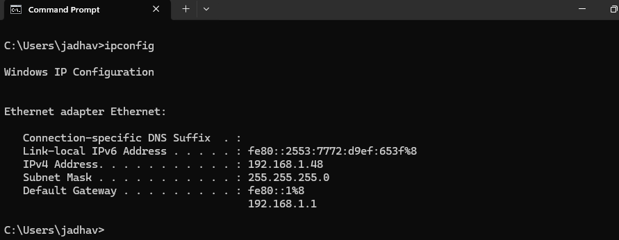
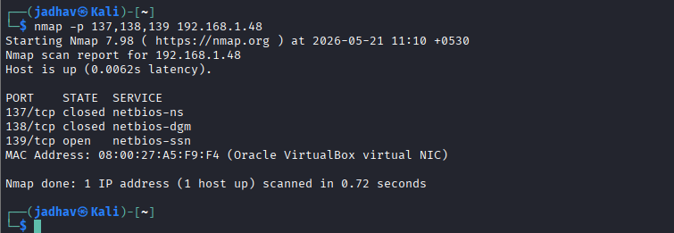
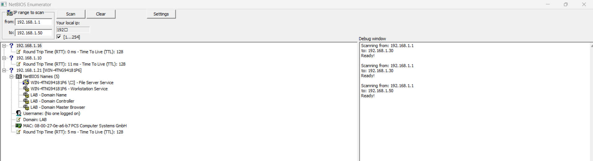
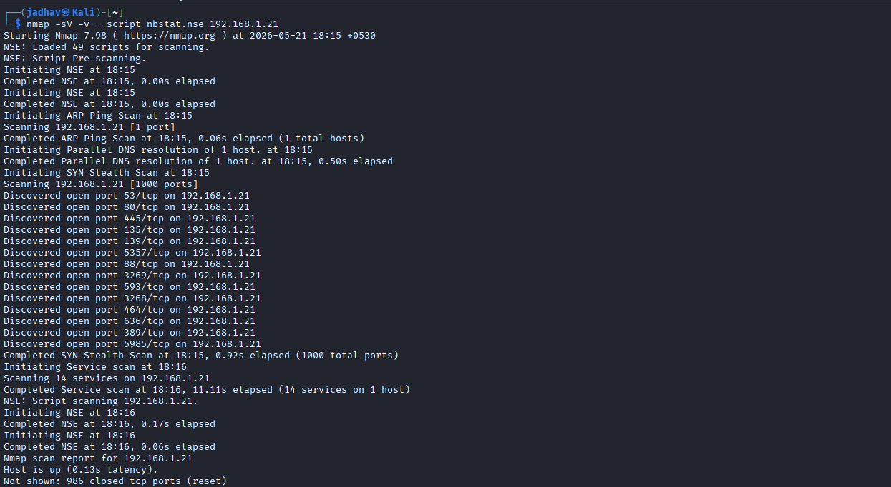
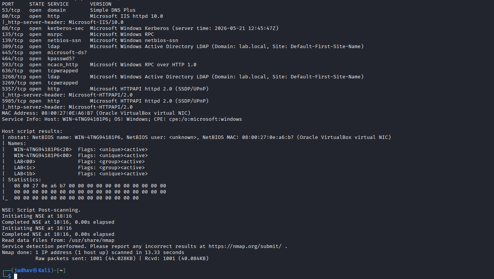

# NetBIOS Enumeration

## What is NetBIOS?

NetBIOS stands for: Network Basic Input/Output System

It is an old Windows networking technology used for:

* Device identification
* File sharing
* Printer sharing
* Communication between Windows systems in a LAN

Each Windows system gets a **NetBIOS name**.

Example:
```text
COMPUTER1
OFFICE-PC
SERVER01
```
# Simple Understanding

Think of NetBIOS like: A name tag for computers inside a local network

Instead of remembering IP addresses like: 192.168.1.10

systems can communicate using names like: SERVER01

# Why Attackers Enumerate NetBIOS?

Attackers use NetBIOS enumeration to collect information from a target system or network.

This helps them discover:

* Computer names
* Logged-in users
* Shared folders
* Domain names
* Services
* MAC addresses
* Policies
* Password-related information

# Important NetBIOS Ports

| Port | Protocol | Purpose                  |
| ---- | -------- | ------------------------ |
| 137  | UDP      | NetBIOS Name Service     |
| 138  | UDP      | NetBIOS Datagram Service |
| 139  | TCP      | NetBIOS Session Service  |


# What Information Can Be Obtained?

During NetBIOS enumeration, attackers may find:

* Hostname
* Domain name
* Usernames
* Shared resources
* Running services
* Workgroup information
* MAC address
* Logged-in users

# NetBIOS Name Types 

| Code   | Meaning                   |
| ------ | ------------------------- |
| `<00>` | Hostname / Domain         |
| `<03>` | Messenger Service         |
| `<20>` | File Sharing Service      |
| `<1B>` | Domain Master Browser     |
| `<1D>` | Master Browser            |
| `<1E>` | Browser Service Elections |


# Main Goal of NetBIOS Enumeration

Identify:
- Who is in the network
- What resources are shared
- Which users exist
- What services are running

# Tools Used in NetBIOS Enumeration

## NetBIOS Enumeration Tools

* Nbtstat
* NetBIOS Enumerator
* Nmap
* Global Network Inventory
* Advanced IP Scanner
* Hyena
* Nsauditor Network Security Auditor

# User Account Enumeration Tools (PsTools)

* PsExec
* PsFile
* PsGetSid
* PsKill
* PsInfo
* PsList
* PsLoggedOn
* PsLogList
* PsPasswd
* PsShutdown

# Shared Resource Enumeration Tool

* Net View
# Nbtstat

# 1. What is Nbtstat?

`nbtstat` is a Windows command-line tool used to:

* View NetBIOS information
* Check NetBIOS names
* View remote computer details
* View NetBIOS cache
* Troubleshoot NetBIOS name resolution problems

It works mainly with: NetBIOS over TCP/IP (NetBT)

# Simple Understanding

Think of `nbtstat` like:
A tool that asks:"Who are you?" to Windows systems in the network

It can reveal:

* Computer name
* Domain/workgroup
* Logged-in user
* File sharing service
* MAC address
* NetBIOS cache

# Why Attackers Use Nbtstat?

Attackers use it because it gives:

* Valuable system information
* Usernames
* Hostnames
* Domain names
* Sharing-related information

without authentication in many cases.

# 2. General Syntax

```bash
nbtstat [option]
```

or

```bash
nbtstat [option] <target>
```
# 3. Full Syntax

```bash
nbtstat [-a <RemoteName>] [-A <IP Address>] [-c] [-n]
         [-r] [-R] [-RR] [-s] [-S] [interval]
```

# 4. Nbtstat Parameters and Functions

| Parameter       | Purpose                                                       |
| --------------- | ------------------------------------------------------------- |
| `-a <hostname>` | Displays NetBIOS name table of remote computer using hostname |
| `-A <IP>`       | Displays NetBIOS name table using IP address                  |
| `-c`            | Shows NetBIOS cache                                           |
| `-n`            | Shows local NetBIOS names                                     |
| `-r`            | Shows resolved names statistics                               |
| `-R`            | Clears and reloads NetBIOS cache                              |
| `-RR`           | Releases and refreshes NetBIOS names                          |
| `-s`            | Shows NetBIOS sessions with converted names                   |
| `-S`            | Shows NetBIOS sessions with IP addresses                      |
| `interval`      | Repeats display every few seconds                             |


# 5. Most Important Commands

# 1 Enumerate Remote System Using IP

```bash
nbtstat -A 192.168.1.10
```

## What It Does

This command:

* Connects to remote system
* Retrieves NetBIOS name table
* Displays services and names

## Example Output

```text
NetBIOS Remote Machine Name Table

Name               Type         Status
---------------------------------------------
SERVER01      <00> UNIQUE      Registered
WORKGROUP     <00> GROUP       Registered
SERVER01      <20> UNIQUE      Registered
WORKGROUP     <1E> GROUP       Registered
```
## What Each Line Means

| Entry         | Meaning                      |
| ------------- | ---------------------------- |
| `<00> UNIQUE` | Computer hostname            |
| `<00> GROUP`  | Workgroup/domain name        |
| `<20>`        | File sharing service enabled |
| `<1E>`        | Browser service              |

## What Attackers Learn

* Computer name
* Workgroup/domain
* File sharing availability
* Network role

# 2  Enumerate Using Hostname

```bash
nbtstat -a SERVER01
```
## Difference Between `-a` and `-A`

| Option | Uses       |
| ------ | ---------- |
| `-a`   | Hostname   |
| `-A`   | IP address |

# 3  View NetBIOS Cache

```bash
nbtstat -c
```

## What It Shows

Displays:

* Cached NetBIOS names
* Resolved IP addresses

## Example Output

```text
NetBIOS Remote Cache Name Table

Name            Type       Host Address
----------------------------------------
SERVER01   <20> UNIQUE     192.168.1.10
```

## Why Important?

Shows systems previously contacted.

# 4 Show Local NetBIOS Names

## Command

```bash
nbtstat -n
```
## What It Shows

Displays:

* Local computer NetBIOS names
* Registered services

## Example Output

```text
Name               Type       Status
----------------------------------------
WINDOWS11    <00> UNIQUE     Registered
WORKGROUP    <00> GROUP      Registered
WINDOWS11    <20> UNIQUE     Registered
```

# 5  Show Name Resolution Statistics


```bash
nbtstat -r
```

## What It Shows

* Number of resolved names
* Broadcast vs WINS statistics


#  6  Clear NetBIOS Cache


```bash
nbtstat -R
```

## Purpose

Clears old cached NetBIOS entries.


# 7  Refresh NetBIOS Names


```bash
nbtstat -RR
```

## Purpose

Refreshes registered NetBIOS names.


# 8 Show Active Sessions


```bash
nbtstat -s
```

## What It Shows

* Active NetBIOS sessions
* Connected systems
* Session states


# 9  Show Sessions with IP Addresses

```bash
nbtstat -S
```

## Difference Between `-s` and `-S`

| Option | Displays       |
| ------ | -------------- |
| `-s`   | Computer names |
| `-S`   | IP addresses   |


# 6. Important NetBIOS Codes

| Code   | Meaning               |
| ------ | --------------------- |
| `<00>` | Workstation Service   |
| `<03>` | Messenger Service     |
| `<20>` | File Sharing Service  |
| `<1B>` | Domain Master Browser |
| `<1D>` | Master Browser        |
| `<1E>` | Browser Elections     |


# NetBIOS Enumeration Practical Lab Flow

# Lab Goal

### Learn: How NetBIOS enumeration works in real practice

Using:

Kali Linux
Windows 11
Windows Server 2019
nmap
nbtstat

# Phase 1 Prepare Lab

# Step 1  Start Machines

# NetBIOS Enumeration Lab Setup

| Machine | Role | Tools/Commands | Target |
|---|---|---|---|
| Kali Linux | Main Attacker | `nmap`, `enum4linux`, `nbtscan` | Windows 11 |
| Windows Server 2019 | Windows Attacker | `nbtstat` | Windows 11 |
| Windows 11 | Victim Machine | NetBIOS/SMB Services | Receives Enumeration |

Why We Need Windows Server 2019 Because:nbtstat is mainly a Windows command


# Step 2 Verify Network Mode

Both VMs should use:

```text id="5qysq4"
Bridged Adapter
```

# Step 3  Get Windows IP Address

On Windows11 CMD:

```cmd 
ipconfig
```


#### we have windows 11 ip: 192.168.1.48

# Phase 2  Verify Connectivity

# Step 4  Ping Target

On Kali:

```bash id="73e8eh"
ping -c3 192.168.1.48
```


#### If Reply Comes Target is reachable

# Phase 3  Discover NetBIOS Services

# Step 5 Scan NetBIOS Ports

```bash id="m40f7d"
nmap -p 137,138,139 192.168.1.48
```


# Analyze Results


# If Port 137 Open

Example:

```text id="lwnfjp"
137/udp open netbios-ns
```

## Meaning

```text id="jbfqqq"
NetBIOS Name Service enabled
```

## Next Step

Run:

```bash id="0vlvs2"
nbtstat -A 192.168.1.48
```

---

# If Port 138 Open

Example:

```text id="24w4cb"
138/udp open netbios-dgm
```

## Meaning

```text id="f8txo8"
NetBIOS Datagram Service enabled
```

## What It Indicates

* Windows network communication
* Browser announcements
* Network discovery traffic

---

# If Port 139 Open

Example:

```text id="lvjlwm"
139/tcp open netbios-ssn
```

## Meaning

```text id="z0grfe"
NetBIOS Session Service enabled
```

## What It Indicates

* Windows networking active
* File sharing registration exists

---

# Phase 4  Main NetBIOS Enumeration

# Step 6  Enumerate Remote System
 
 Run On: Windows Server 2019
## Main Command

```bash id="yzl8gw"
nbtstat -A 192.168.1.48
```


enumerate NetBIOS information from the target Windows 11 machine. The output revealed the computer name (`DESKTOP-OUQMTNR`), workgroup name (`WORKGROUP`), and the target MAC address (`08-00-27-A5-F9-F4`). This confirms that NetBIOS services are enabled and responding on the target system.

# Phase 5  Enumerate Using Hostname

# Step 7  Use Hostname Enumeration

If hostname discovered:

Example:

```text id="r79bks"
SERVER01
```

Run:

```bash id="bq6d7s"
nbtstat -a SERVER01
```


# Why?

Because NetBIOS supports:

```text id="tfeq8f"
Name-based enumeration
```

not just IP-based enumeration.


# Phase 6 Local NetBIOS Investigation

# Step 8 View Local Names

On Windows:

```cmd id="4ww1sn"
nbtstat -n
```


# Learn

* Local hostname
* Registered services
* Local NetBIOS entries


# Step 9 — View Cache

```cmd id="ksjlwm"
nbtstat -c
```


# Learn

Previously contacted systems.


# Step 10 View Statistics

```cmd id="jts4yo"
nbtstat -r
```


# Learn

* Broadcast resolutions
* WINS resolutions
# Step 11 View Sessions

```cmd id="jlwm2z"
nbtstat -s
```

and

```cmd id="sg7n8i"
nbtstat -S
```

# Learn

* Active NetBIOS sessions
* Connected systems
* Session state
------
-------
# NetBIOS Enumerator

## Overview

NetBIOS Enumerator is a Windows network enumeration tool used to gather information from systems running NetBIOS and SMB services. It scans a range of IP addresses and extracts useful network information from Windows machines.

This tool is commonly used during the: Information Gathering / Enumeration Phase


of penetration testing.


# Purpose of the Tool

NetBIOS Enumerator helps identify:

* Windows systems
* NetBIOS names
* Usernames
* Domain/workgroup names
* MAC addresses
* SMB-enabled hosts

It communicates with Windows networking services to collect information exposed over the network.


# Download

Official Source:

[NetBIOS Enumerator SourceForge](https://nbtenum.sourceforge.net/?utm_source=chatgpt.com)

# Lab Setup

## Attacker Machine

* Windows 10/11
  OR
* Kali Linux

## Victim Machines

* Windows systems
* SMB-enabled machines
* Systems inside the same network


# Interface Overview

## Scan Button

Starts the NetBIOS enumeration process.

---

## Clear Button

Clears previous scan results.

---

## Settings Button

Contains tool configuration options.

---

## Debug Window

Displays scan progress and debugging information.

---

# Practical Example

## Scenario

Suppose the attacker machine is connected to the network:

```text
192.168.1.0/24
```

The goal is to scan systems from:

```text
192.168.1.1 → 192.168.1.30
```

to identify Windows hosts and NetBIOS information.


## Step 1 Open NetBIOS Enumerator

Launch:

```text
NetBIOS Enumerator.exe
```

---

## Step 2 Enter IP Range

Fill the fields:

```text
from: 192.168.1.1
to:   192.168.1.30
```

---

## Step 3 Start Scan

Click:

```text
Scan
```

The tool will now enumerate all systems within the range.

---

## Step 4 Observe Results

If systems respond, information may appear like:

```text
SERVER2019
WORKGROUP
Administrator
00-15-5D-64-A4-22
```

---

# Information Collected

| Information      | Description               |
| ---------------- | ------------------------- |
| NetBIOS Name     | Computer name             |
| Username         | Logged-in user            |
| Domain/Workgroup | Windows network group     |
| MAC Address      | Physical device address   |
| SMB Service      | File sharing availability |




------------
-----------

# Nmap for NetBIOS Enumeration

## Overview

Nmap can perform NetBIOS enumeration using the: Nmap Scripting Engine (NSE)

The `nbstat.nse` script helps retrieve:

* NetBIOS names
* Computer names
* Logged-in users
* MAC addresses
* Domain/workgroup names

from Windows systems.

# Purpose

This script is used to identify Windows network information through NetBIOS services.

# Command Used

```bash id="9y6o4u"
nmap -sV -v --script nbstat.nse <target-ip>
```

Example:

```bash id="d06om5"
nmap -sV -v --script nbstat.nse 192.168.1.21
```

# Command Breakdown

| Option                | Meaning                        |
| --------------------- | ------------------------------ |
| `-sV`                 | Detect service versions        |
| `-v`                  | Verbose output                 |
| `--script nbstat.nse` | Run NetBIOS enumeration script |
| `192.168.1.22`        | Target IP address              |




------------
----------

# Net View

## Overview

`Net View` is a Windows command-line utility used to display:

* shared folders
* shared resources
* computers in a domain/workgroup

It is commonly used during:NetBIOS Enumeration

# Purpose

The command helps identify:

* available shared folders
* network computers
* hidden shares
* domain systems

# Basic Syntax

```cmd id="m9mkdb"
net view
```
Displays available computers in the network.

# View Shares on a Specific Computer

```cmd id="e9hx6t"
net view \\<computername>
```

Example:

```cmd id="95sg7x"
net view \\192.168.1.10
```

or

```cmd id="v4aq8n"
net view \\WIN10-PC
```
# View All Shares Including Hidden Shares

```cmd id="wx0hvn"
net view \\<computername> /ALL
```

Example:

```cmd id="e2tv6f"
net view \\192.168.1.10 /ALL
```

This may display:

* shared folders
* administrative shares
* hidden shares

# View Domain Computers

```cmd id="9q4g5z"
net view /domain
```
Displays systems in the current domain.

# View Specific Domain

```cmd id="2tjlwm"
net view /domain:<domain-name>
```

Example:

```cmd id="yjlwm"
net view /domain:LAB
```

# Practical Example

## Enumerate Shared Resources

```cmd id="7jlwm"
net view \\192.168.1.10
```

Possible Output:

```text id="8jlwm"
Share name   Type
--------------------------------
Users        Disk
Public       Disk
IPC$         IPC
```


# Information Collected

| Information    | Description                   |
| -------------- | ----------------------------- |
| Shared Folders | Accessible shared directories |
| Hidden Shares  | Administrative shares         |
| Domain Systems | Computers inside domain       |
| SMB Resources  | Shared network resources      |

