# NetBIOS Enumeration 

## Lab Environment

| Machine | IP Address | Role |
|---------|------------|------|
| Kali Linux | `192.168.1.19` | Attacker |
| Metasploitable 2 | `192.168.1.39` | Target |

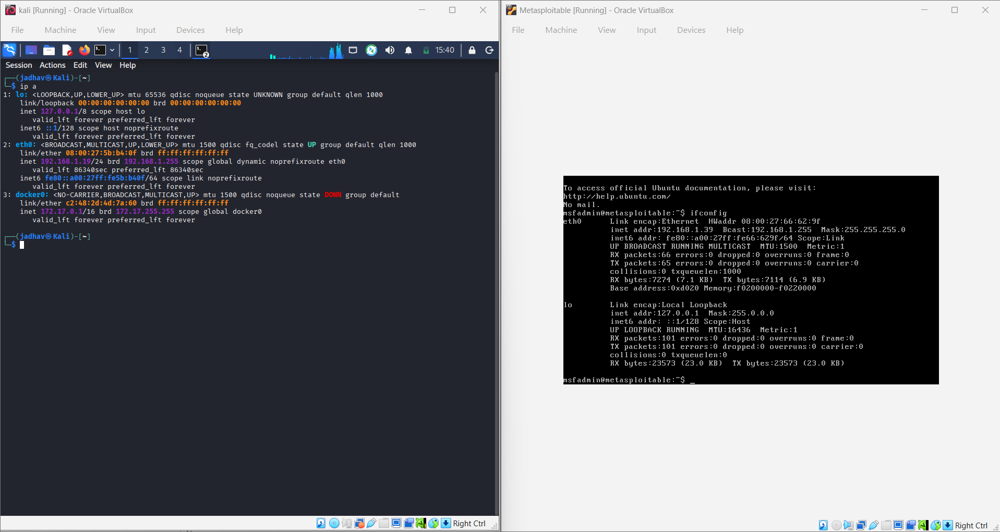

## Part 1: Theory - What is NetBIOS?

**NetBIOS** = Network Basic Input/Output System

- NetBIOS name is a unique **16 ASCII character** string
- **15 characters** = device name
- **16th character** = reserved for service type

### Ports Used

| Port | Protocol | Service |
|------|----------|---------|
| 137 | UDP | NetBIOS Name Service |
| 138 | UDP | NetBIOS Datagram Service |
| 139 | TCP | NetBIOS Session Service |

### NetBIOS Name Table

| Name | Code | Type | Information |
|------|------|------|-------------|
| `<host name>` | `<00>` | UNIQUE | Hostname |
| `<domain>` | `<00>` | GROUP | Domain name |
| `<host name>` | `<20>` | UNIQUE | Server service running |
| `<domain>` | `<1D>` | GROUP | Master browser name |
| `<domain>` | `<1B>` | UNIQUE | Primary Domain Controller |

## 2.1 Check Network Connectivity

First, verify both machines can communicate:

### Command

```bash
ping -c 3 192.168.1.39
```

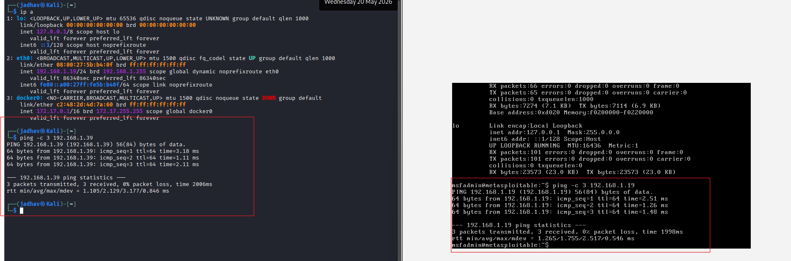

---

## 2.2 Scan for NetBIOS/SMB Ports

### Command

```bash
nmap -p 135,139,445 192.168.1.39
```

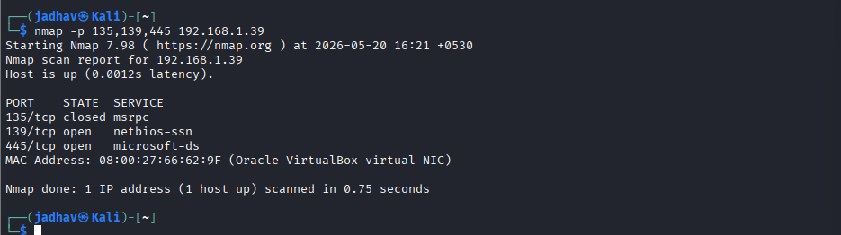

---

## 2.3 NetBIOS Name Enumeration with Nmap

### Command

```bash
nmap -sV -v --script nbstat.nse 192.168.1.39
```

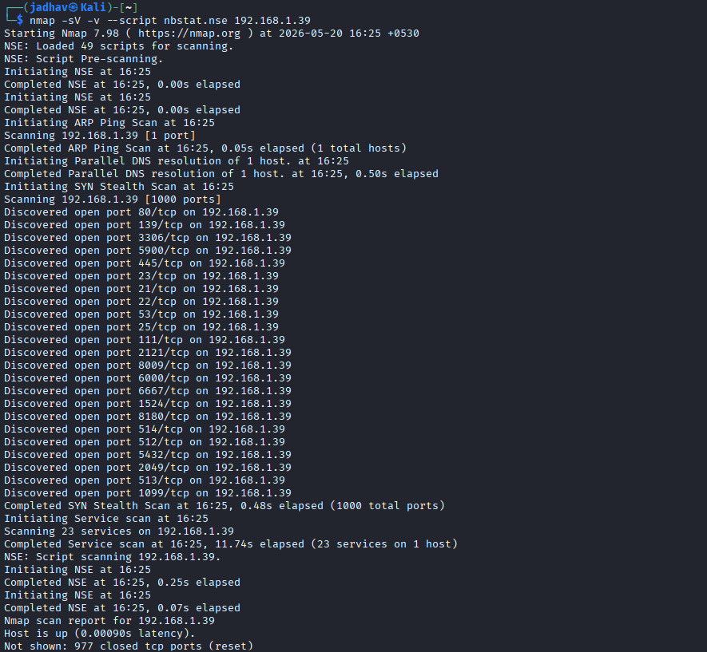
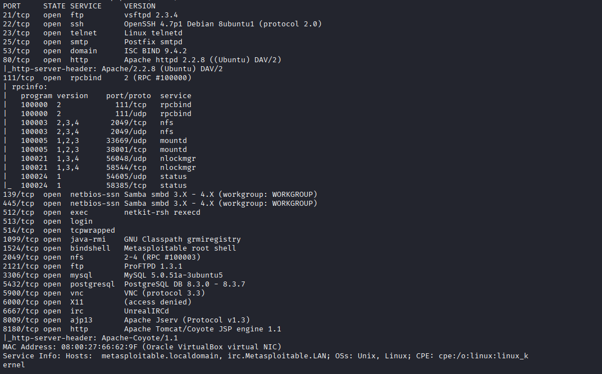
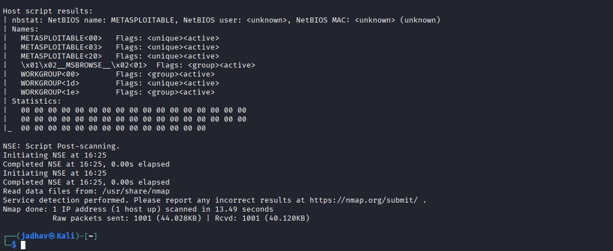


## 2.4 Enumerate SMB Shares

### Command

```bash
nmap --script smb-enum-shares.nse -p 445 192.168.1.39
```

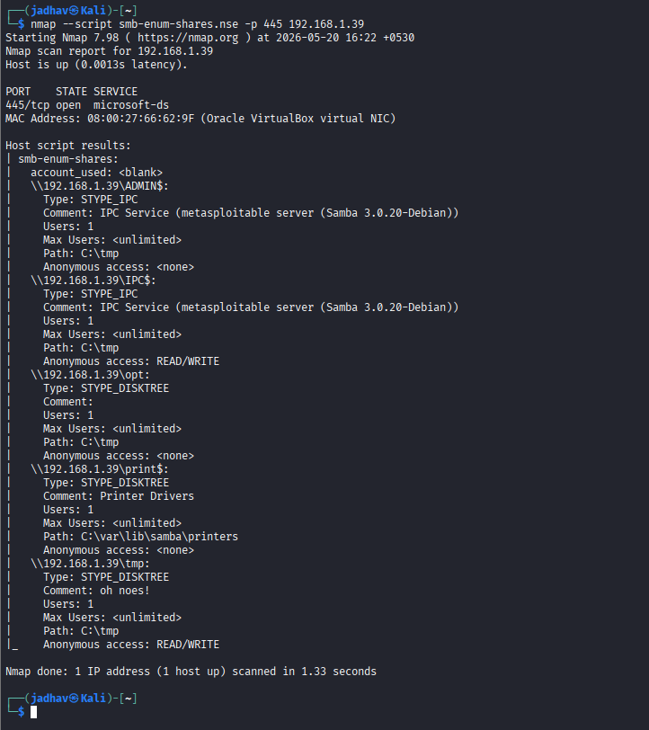

---

## 2.5 Enumerate SMB Users

### Command

```bash
nmap --script smb-enum-users.nse -p 445 192.168.1.39
```

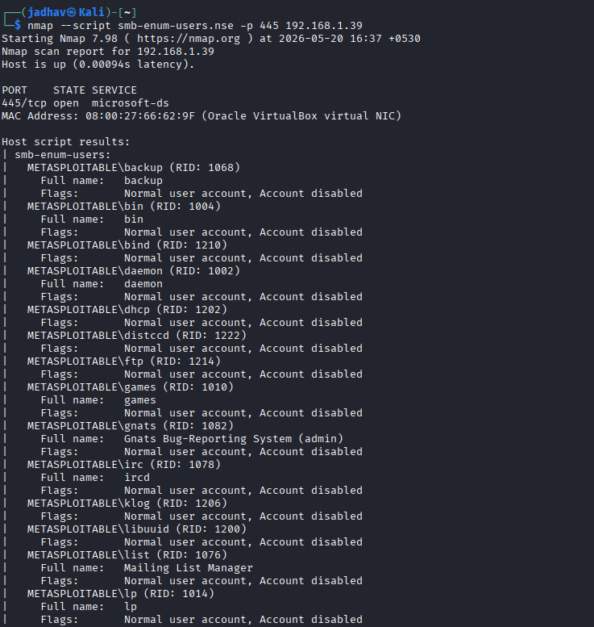
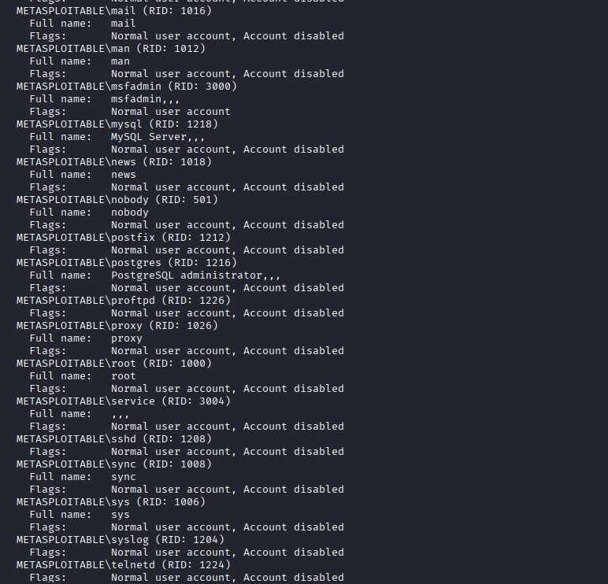
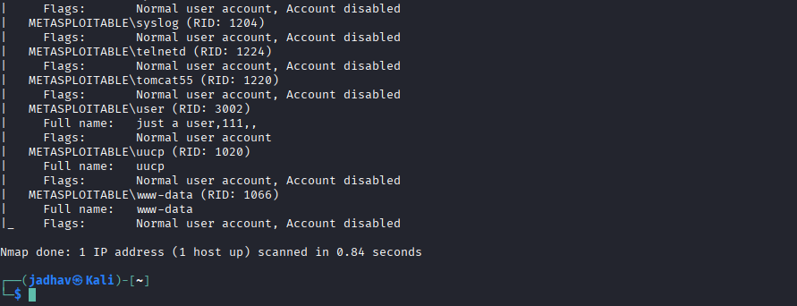

---

## 2.6 Complete Enumeration with enum4linux (Best Tool)

### Command

```bash
enum4linux -a 192.168.1.39
```

This will show:

- User list
- Share list
- Group list
- Password policy
- OS information

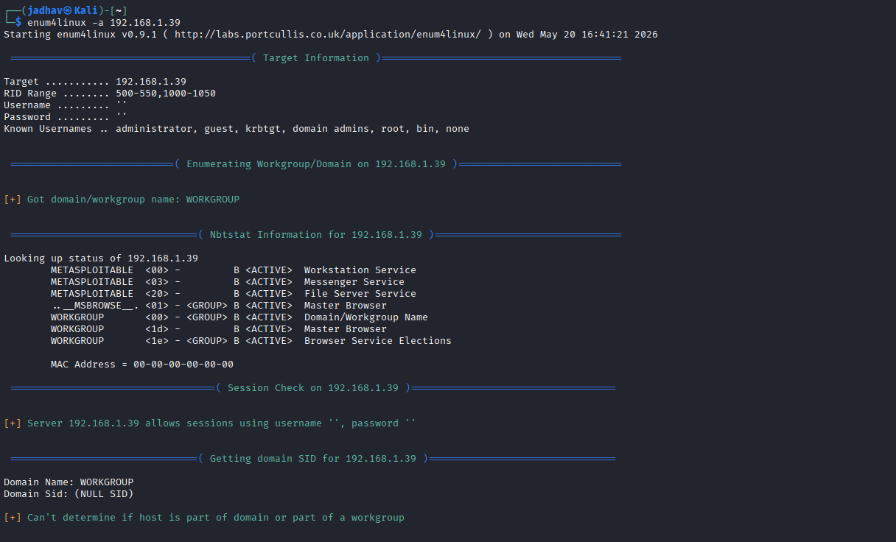

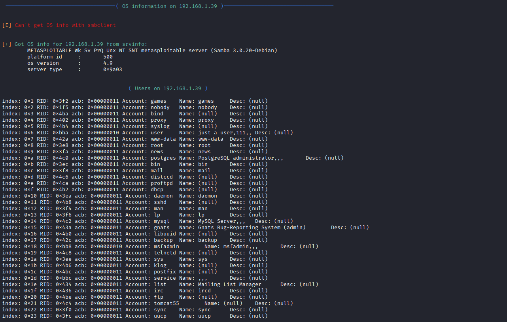


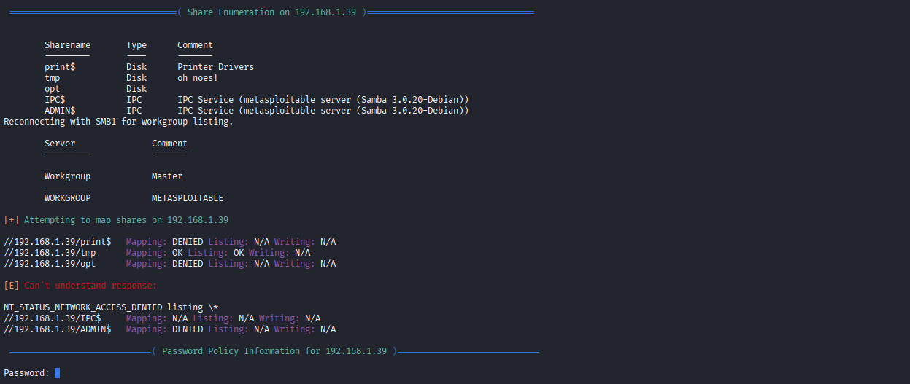

---

## 2.7 Quick NetBIOS Discovery with nbtscan

### Command

```bash
nbtscan 192.168.1.0/24
```

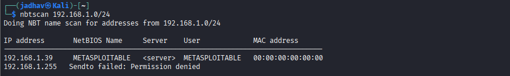

---

## 2.8 List SMB Shares with smbclient (Null Session)

### Command

```bash
smbclient -L //192.168.1.39 -N
```

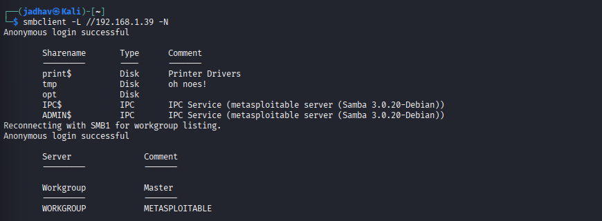

---

## 2.9 Try to Connect to a Share

### Command

```bash
smbclient //192.168.1.39/tmp -N
```

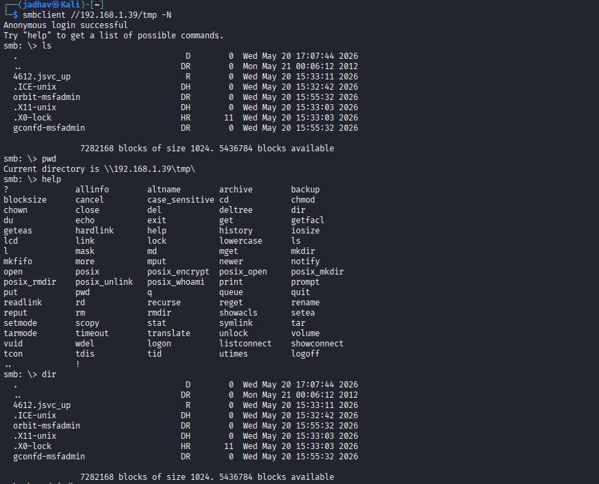
