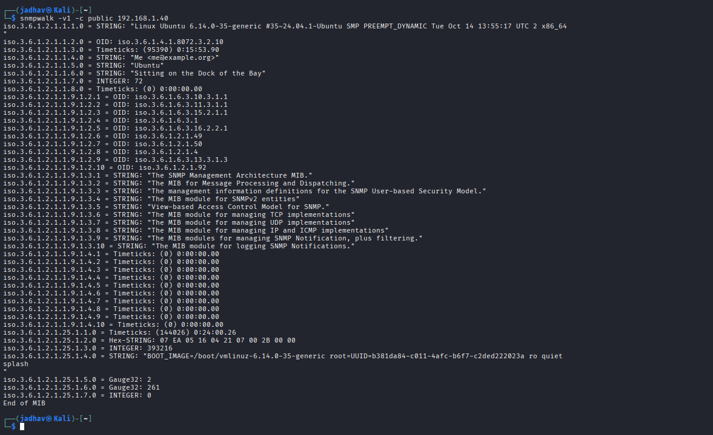
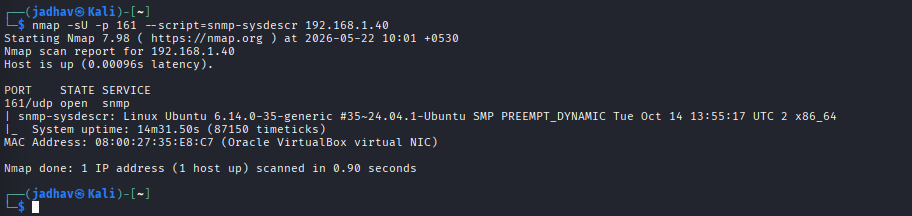
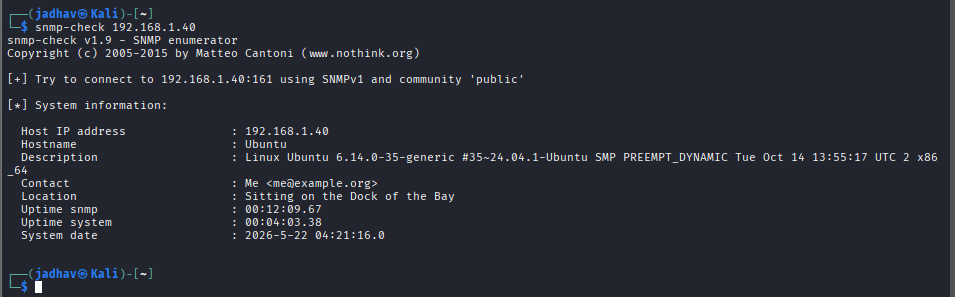

# SNMP Enumeration
## What is SNMP?
SNMP stands for: Simple Network Management Protocol
It is used by administrators to:
* Monitor network devices
* Manage routers/switches
* Check system status remotely
SNMP works mainly on: UDP Port 161

# Simple Real-Life Understanding

Think like this: SNMP = Remote Control + Information Center for network devices
Using SNMP, administrators can remotely see:

* Device name
* System information
* Running services
* Installed software
* Network interfaces
* Users
* RAM
* Routing tables
* Traffic statistics

# Why Attackers Like SNMP

Many devices use:

```text
public
private
```

as default community strings (passwords).

If administrators forget to change them:

* Attackers can collect sensitive information
* Sometimes attackers can modify configurations

# SNMP Components

## 1. SNMP Manager

The controlling system.

Example:

```text
Administrator machine
```

## 2. SNMP Agent

Runs on target device.

Example:

```text
Router
Windows Server
Switch
Printer
Linux Machine
```

# SNMP Community Strings

These are like passwords.

## Read Community String

Usually:

```text
public
```

Allows:

* Viewing information
* Enumeration

## Read/Write Community String

Usually:

```text
private
```

Allows:

* Changing configurations
* Editing values

Very dangerous if exposed.

# What Attackers Can Enumerate

Using SNMP attackers may collect:

* Hostname
* OS version
* Running processes
* Installed software
* User accounts
* Network interfaces
* Routing tables
* ARP tables
* Open ports
* System uptime
* RAM information

# Working of SNMP

## Step 1 Device Starts
SNMP agent starts on target device.
Usually listens on: UDP 161
## Step 2 Discovery
Manager searches for SNMP-enabled devices.
## Step 3 Information Exchange
Manager sends requests.
Agent replies with information.
# Important SNMP Requests

## Get Request

Gets one value.

Example: System name

## GetNext Request

Gets next available value in database.
Used for walking through information.

## Set Request
Changes values on device.
Dangerous if write access exists.

## Trap

Device automatically sends alerts.
Example:

* Device reboot
* Interface down

# MIB (Management Information Base)

## What is MIB?

MIB is: Database of SNMP information
Contains all manageable objects.

# OID (Object Identifier)

Every SNMP value has unique ID.
Example: 1.3.6.1.2.1
This is called OID.

# Important Enumeration Tools
## 1. SnmpWalk
Most common SNMP enumeration tool.

## Basic Command

```bash id="zxyvtm"
snmpwalk -v1 -c public <Target-IP>
```

### Meaning

| Part          | Meaning          |
| ------------- | ---------------- |
| `-v1`         | SNMP Version 1   |
| `-c public`   | Community string |
| `<Target-IP>` | Victim machine   |

```bash
snmpwalk -v1 -c public 192.168.1.
```
# What SnmpWalk Does

It walks through the MIB database and retrieves information.

Can reveal:

* OS details
* Users
* Processes
* Interfaces
* Services
* RAM
* Hostname

# Useful SnmpWalk Commands

## SNMPv2 Enumeration

```bash id="pq6t95"
snmpwalk -v2c -c public <Target-IP>
```

## Installed Software

```bash id="qlpccm"
snmpwalk -v2c -c public <Target-IP> hrSWInstalledName
```

## RAM Information

```bash id="3a8mow"
snmpwalk -v2c -c public <Target-IP> hrMemorySize
```

# SNMP Enumeration Using Nmap

Nmap has NSE scripts for SNMP.

## Running Processes

```bash id="u4tn4r"
nmap -sU -p 161 --script=snmp-processes <Target-IP>
```

Gets:

* Running processes
* Process paths

## System Information

```bash id="tmr8fr"
nmap -sU -p 161 --script=snmp-sysdescr <Target-IP>
```

Gets:

* OS details
* Device information


## Installed Applications

```bash id="d88q64"
nmap -sU -p 161 --script=snmp-win32-software <Target-IP>
```

Gets:

* Installed software list


# snmp-check Tool

Very powerful enumeration tool.

## Command

```bash id="c9b9fd"
snmp-check <Target-IP>
```

# Information Gathered

* Hostname
* OS version
* Users
* Network interfaces
* TCP connections
* Routing information
* Uptime
* Processes

# SoftPerfect Network Scanner

GUI-based network scanner.

Can:

* Scan devices
* Discover shares
* Detect SNMP services
* Gather network information


## Kali Linux → Ubuntu


# Lab Title

```text id="avj2q1"
SNMP Enumeration Practical Demonstration Using Kali Linux and Ubuntu
```
# Lab Environment

| Machine    | Role             | IP Address   |
| ---------- | ---------------- | ------------ |
| Kali Linux | Attacker Machine | 192.168.1.14 |
| Ubuntu     | Target Machine   | 192.168.1.40 |

# Default SNMP Port

| Port | Protocol |
| ---- | -------- |
| 161  | UDP      |


# SNMP Community Strings

| Community String | Access     |
| ---------------- | ---------- |
| public           | Read Only  |
| private          | Read/Write |


# Phase 1 — Verify Connectivity

# Check Kali IP

On Kali:

```bash id="f5k1w9"
ip a
```

Result:

```text id="z7d4p2"
192.168.1.14
```

# Check Ubuntu IP

On Ubuntu:

```bash id="x9q2e6"
ip a
```

Result:

```text id="u4c7m1"
192.168.1.40
```


# Test Connectivity

From Kali:

```bash id="k3v8t5"
ping 192.168.1.40
```

Result:

```text id="d1n7r3"
64 bytes from 192.168.1.40
```

Meaning:

```text id="y2f9m6"
Network communication successful
```


# Phase 2 — Install SNMP on Ubuntu

# Update Packages

```bash id="p8m1q4"
sudo apt update
```


# Install SNMP

```bash id="t5v7k2"
sudo apt install snmpd snmp -y
```

# Verify SNMP Service

```bash id="q2n4c8"
sudo systemctl status snmpd
```

Expected:

```text id="m8r6z1"
active (running)
```


# Phase 3 — Configure SNMP

# Open Configuration File

```bash id="b7x2j5"
sudo nano /etc/snmp/snmpd.conf
```


# Modify Listening Address

Find:

```text id="h4p9w2"
agentAddress 127.0.0.1,[::1]
```

Replace with:

```text id="s6k3n8"
agentAddress udp:161
```

# Configure Community String

Find or add:

```text id="v1d5r7"
rocommunity public
```

Meaning:

```text id="c9m2q6"
Read-only SNMP access using public community string
```

# Save Configuration

```text id="r4x8w1"
CTRL + O
Enter
CTRL + X
```


# Restart SNMP Service

```bash id="n7q3k9"
sudo systemctl restart snmpd
```

Enable service:

```bash id="e2m6v4"
sudo systemctl enable snmpd
```

# Verify UDP Port 161

```bash id="w8d1c7"
sudo netstat -anu | grep 161
```

Expected:

```text id="j5k9n2"
udp 0 0 0.0.0.0:161
```

Meaning:

```text id="x3r7m8"
SNMP service listening successfully
```

# Phase 4 — Discover SNMP Service

# Scan UDP Port 161

From Kali:

```bash id="u6v2k5"
nmap -sU -p 161 192.168.1.40
```


# Meaning of Command

| Option         | Meaning        |
| -------------- | -------------- |
| `-sU`          | UDP Scan       |
| `-p 161`       | Scan SNMP Port |
| `192.168.1.40` | Target IP      |

# Expected Result

```text id="y9q4m7"
161/udp open snmp
```

Meaning:

```text id="g2w8k1"
SNMP service detected successfully
```

# Phase 5 — SNMP Enumeration Using snmpwalk

# Basic Enumeration

```bash id="m5v1r8"
snmpwalk -v1 -c public 192.168.1.40
```

# Meaning of Command

| Part           | Meaning               |
| -------------- | --------------------- |
| `snmpwalk`     | SNMP Enumeration Tool |
| `-v1`          | SNMP Version 1        |
| `-c public`    | Community String      |
| `192.168.1.40` | Target IP             |


# Purpose of snmpwalk

`snmpwalk` walks through the MIB database and retrieves SNMP information.



# Information Gathered

Possible information collected:

* Hostname
* Ubuntu version
* Running services
* Network interfaces
* Routing information
* System uptime
* Network statistics


# Expected Output

```text id="r8w4m1"
SNMPv2-MIB::sysDescr
SNMPv2-MIB::sysName
```

Meaning:

```text id="t6x2k9"
SNMP enumeration successful
```

# Phase 6 — Enumeration Using Nmap NSE Scripts

# Get System Information

```bash id="k1q8v3"
nmap -sU -p 161 --script=snmp-sysdescr 192.168.1.40
```


Purpose:

* OS details
* Device information
* System description

# Enumerate Running Processes

```bash id="v4m7r2"
nmap -sU -p 161 --script=snmp-processes 192.168.1.40
```

Purpose:

* Running processes
* Process paths

# Enumerate Interfaces

```bash id="z3n5w8"
nmap -sU -p 161 --script=snmp-interfaces 192.168.1.40
```

Purpose:

* Network interfaces
* MAC addresses
* Interface details


# Phase 7 — SNMP Enumeration Using snmp-check

# Run snmp-check

```bash id="q6x1m4"
snmp-check 192.168.1.40
```

# Information Collected

* Hostname
* OS version
* Network interfaces
* Routing information
* TCP connections
* System uptime

# Attack Flow

```text id="n2r7k5"
Discover UDP 161
        ↓
Identify SNMP Service
        ↓
Use Community String
        ↓
Enumerate SNMP Information
        ↓
Collect Sensitive Data
```

