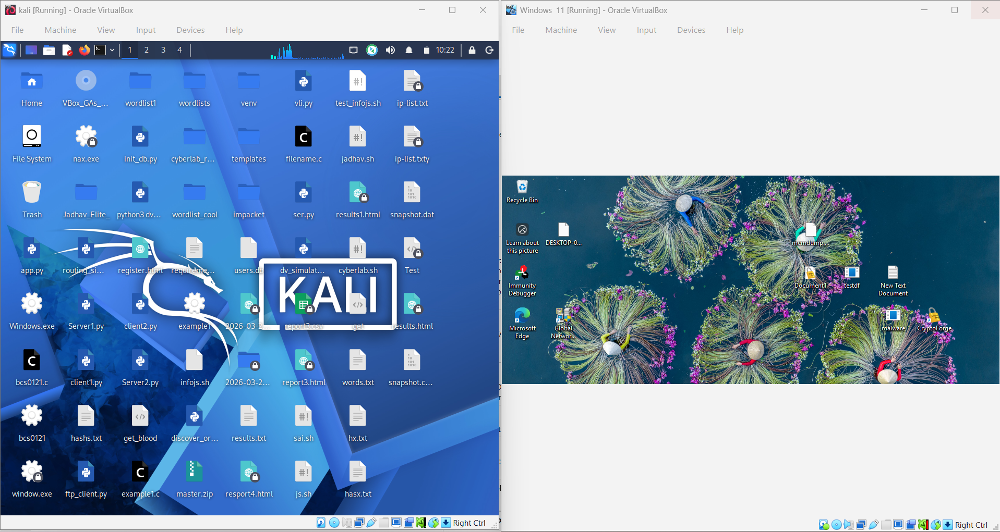
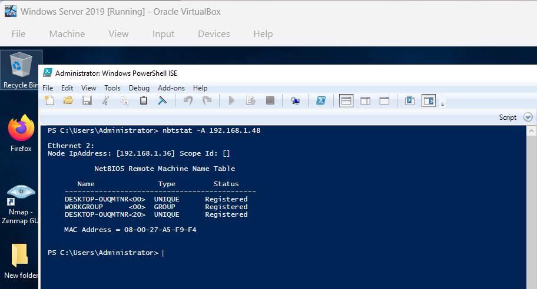

# Nbtstat

# 1. What is Nbtstat?

`nbtstat` is a Windows command-line tool used to:

* View NetBIOS information
* Check NetBIOS names
* View remote computer details
* View NetBIOS cache
* Troubleshoot NetBIOS name resolution problems

It works mainly with: NetBIOS over TCP/IP (NetBT)

# Simple Understanding

Think of `nbtstat` like:
A tool that asks:"Who are you?" to Windows systems in the network

It can reveal:

* Computer name
* Domain/workgroup
* Logged-in user
* File sharing service
* MAC address
* NetBIOS cache

# Why Attackers Use Nbtstat?

Attackers use it because it gives:

* Valuable system information
* Usernames
* Hostnames
* Domain names
* Sharing-related information

without authentication in many cases.

# 2. General Syntax

```bash
nbtstat [option]
```

or

```bash
nbtstat [option] <target>
```
# 3. Full Syntax

```bash
nbtstat [-a <RemoteName>] [-A <IP Address>] [-c] [-n]
         [-r] [-R] [-RR] [-s] [-S] [interval]
```

# 4. Nbtstat Parameters and Functions

| Parameter       | Purpose                                                       |
| --------------- | ------------------------------------------------------------- |
| `-a <hostname>` | Displays NetBIOS name table of remote computer using hostname |
| `-A <IP>`       | Displays NetBIOS name table using IP address                  |
| `-c`            | Shows NetBIOS cache                                           |
| `-n`            | Shows local NetBIOS names                                     |
| `-r`            | Shows resolved names statistics                               |
| `-R`            | Clears and reloads NetBIOS cache                              |
| `-RR`           | Releases and refreshes NetBIOS names                          |
| `-s`            | Shows NetBIOS sessions with converted names                   |
| `-S`            | Shows NetBIOS sessions with IP addresses                      |
| `interval`      | Repeats display every few seconds                             |


# 5. Most Important Commands

# 1 Enumerate Remote System Using IP

```bash
nbtstat -A 192.168.1.10
```

## What It Does

This command:

* Connects to remote system
* Retrieves NetBIOS name table
* Displays services and names

## Example Output

```text
NetBIOS Remote Machine Name Table

Name               Type         Status
---------------------------------------------
SERVER01      <00> UNIQUE      Registered
WORKGROUP     <00> GROUP       Registered
SERVER01      <20> UNIQUE      Registered
WORKGROUP     <1E> GROUP       Registered
```
## What Each Line Means

| Entry         | Meaning                      |
| ------------- | ---------------------------- |
| `<00> UNIQUE` | Computer hostname            |
| `<00> GROUP`  | Workgroup/domain name        |
| `<20>`        | File sharing service enabled |
| `<1E>`        | Browser service              |

## What Attackers Learn

* Computer name
* Workgroup/domain
* File sharing availability
* Network role

# 2  Enumerate Using Hostname

```bash
nbtstat -a SERVER01
```
## Difference Between `-a` and `-A`

| Option | Uses       |
| ------ | ---------- |
| `-a`   | Hostname   |
| `-A`   | IP address |

# 3  View NetBIOS Cache

```bash
nbtstat -c
```

## What It Shows

Displays:

* Cached NetBIOS names
* Resolved IP addresses

## Example Output

```text
NetBIOS Remote Cache Name Table

Name            Type       Host Address
----------------------------------------
SERVER01   <20> UNIQUE     192.168.1.10
```

## Why Important?

Shows systems previously contacted.

# 4 Show Local NetBIOS Names

## Command

```bash
nbtstat -n
```
## What It Shows

Displays:

* Local computer NetBIOS names
* Registered services

## Example Output

```text
Name               Type       Status
----------------------------------------
WINDOWS11    <00> UNIQUE     Registered
WORKGROUP    <00> GROUP      Registered
WINDOWS11    <20> UNIQUE     Registered
```

# 5  Show Name Resolution Statistics


```bash
nbtstat -r
```

## What It Shows

* Number of resolved names
* Broadcast vs WINS statistics


#  6  Clear NetBIOS Cache


```bash
nbtstat -R
```

## Purpose

Clears old cached NetBIOS entries.


# 7  Refresh NetBIOS Names


```bash
nbtstat -RR
```

## Purpose

Refreshes registered NetBIOS names.


# 8 Show Active Sessions


```bash
nbtstat -s
```

## What It Shows

* Active NetBIOS sessions
* Connected systems
* Session states


# 9  Show Sessions with IP Addresses

```bash
nbtstat -S
```

## Difference Between `-s` and `-S`

| Option | Displays       |
| ------ | -------------- |
| `-s`   | Computer names |
| `-S`   | IP addresses   |


# 6. Important NetBIOS Codes

| Code   | Meaning               |
| ------ | --------------------- |
| `<00>` | Workstation Service   |
| `<03>` | Messenger Service     |
| `<20>` | File Sharing Service  |
| `<1B>` | Domain Master Browser |
| `<1D>` | Master Browser        |
| `<1E>` | Browser Elections     |


# NetBIOS Enumeration Practical Lab Flow

# Lab Goal

### Learn: How NetBIOS enumeration works in real practice

Using:

Kali Linux
Windows 11
Windows Server 2019
nmap
nbtstat

# Phase 1 Prepare Lab

# Step 1  Start Machines

# NetBIOS Enumeration Lab Setup

| Machine | Role | Tools/Commands | Target |
|---|---|---|---|
| Kali Linux | Main Attacker | `nmap`, `enum4linux`, `nbtscan` | Windows 11 |
| Windows Server 2019 | Windows Attacker | `nbtstat` | Windows 11 |
| Windows 11 | Victim Machine | NetBIOS/SMB Services | Receives Enumeration |

Why We Need Windows Server 2019 Because:nbtstat is mainly a Windows command



# Step 2 Verify Network Mode

Both VMs should use:

```text id="5qysq4"
Bridged Adapter
```

# Step 3  Get Windows IP Address

On Windows11 CMD:

```cmd 
ipconfig
```


#### we have windows 11 ip: 192.168.1.48

# Phase 2  Verify Connectivity

# Step 4  Ping Target

On Kali:

```bash id="73e8eh"
ping -c3 192.168.1.48
```


#### If Reply Comes Target is reachable

# Phase 3  Discover NetBIOS Services

# Step 5 Scan NetBIOS Ports

```bash id="m40f7d"
nmap -p 137,138,139 192.168.1.48
```


# Analyze Results


# If Port 137 Open

Example:

```text id="lwnfjp"
137/udp open netbios-ns
```

## Meaning

```text id="jbfqqq"
NetBIOS Name Service enabled
```

## Next Step

Run:

```bash id="0vlvs2"
nbtstat -A 192.168.1.48
```

---

# If Port 138 Open

Example:

```text id="24w4cb"
138/udp open netbios-dgm
```

## Meaning

```text id="f8txo8"
NetBIOS Datagram Service enabled
```

## What It Indicates

* Windows network communication
* Browser announcements
* Network discovery traffic

---

# If Port 139 Open

Example:

```text id="lvjlwm"
139/tcp open netbios-ssn
```

## Meaning

```text id="z0grfe"
NetBIOS Session Service enabled
```

## What It Indicates

* Windows networking active
* File sharing registration exists

---

# Phase 4  Main NetBIOS Enumeration

# Step 6  Enumerate Remote System
 
 Run On: Windows Server 2019
## Main Command

```bash id="yzl8gw"
nbtstat -A 192.168.1.48
```


enumerate NetBIOS information from the target Windows 11 machine. The output revealed the computer name (`DESKTOP-OUQMTNR`), workgroup name (`WORKGROUP`), and the target MAC address (`08-00-27-A5-F9-F4`). This confirms that NetBIOS services are enabled and responding on the target system.

# Phase 5  Enumerate Using Hostname

# Step 7  Use Hostname Enumeration

If hostname discovered:

Example:

```text id="r79bks"
SERVER01
```

Run:

```bash id="bq6d7s"
nbtstat -a SERVER01
```

---

# Why?

Because NetBIOS supports:

```text id="tfeq8f"
Name-based enumeration
```

not just IP-based enumeration.

---

# Phase 6 Local NetBIOS Investigation

# Step 8 View Local Names

On Windows:

```cmd id="4ww1sn"
nbtstat -n
```

---

# Learn

* Local hostname
* Registered services
* Local NetBIOS entries

---

# Step 9 — View Cache

```cmd id="ksjlwm"
nbtstat -c
```

---

# Learn

Previously contacted systems.

---

# Step 10 View Statistics

```cmd id="jts4yo"
nbtstat -r
```

---

# Learn

* Broadcast resolutions
* WINS resolutions

---

# Step 11 View Sessions

```cmd id="jlwm2z"
nbtstat -s
```

and

```cmd id="sg7n8i"
nbtstat -S
```

---

# Learn

* Active NetBIOS sessions
* Connected systems
* Session state

---
